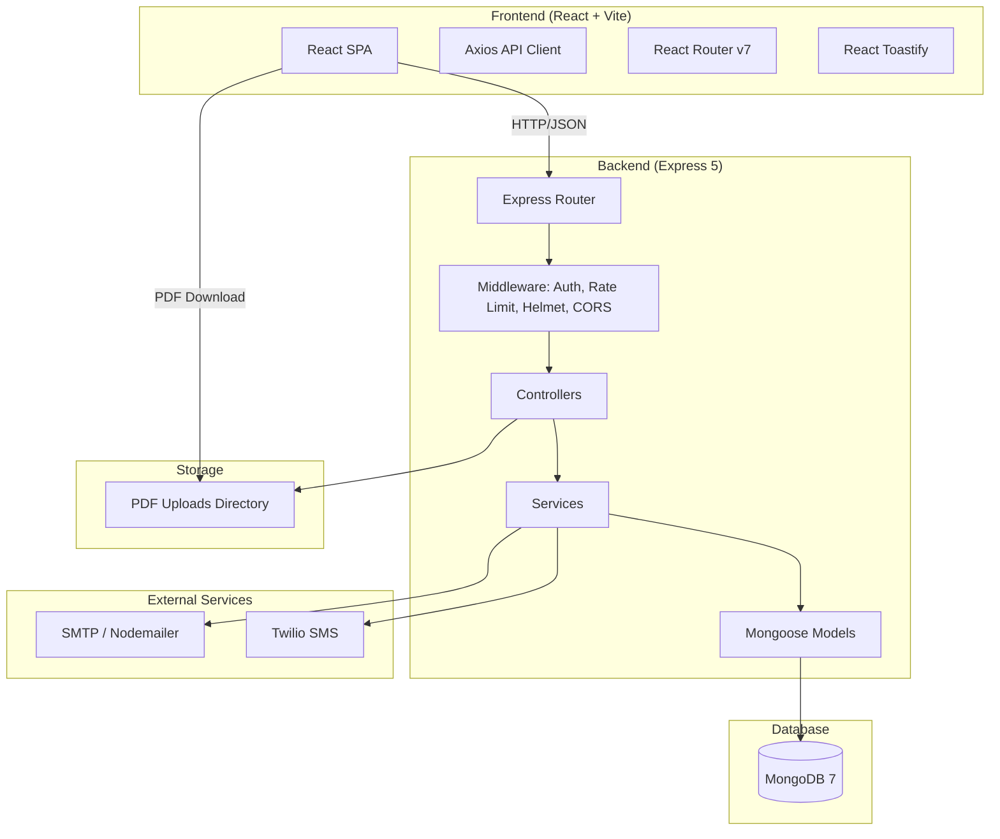
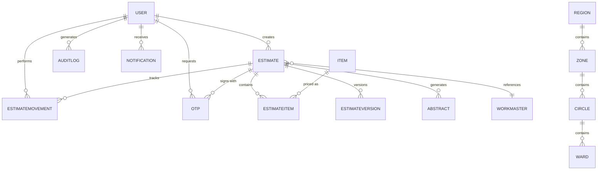
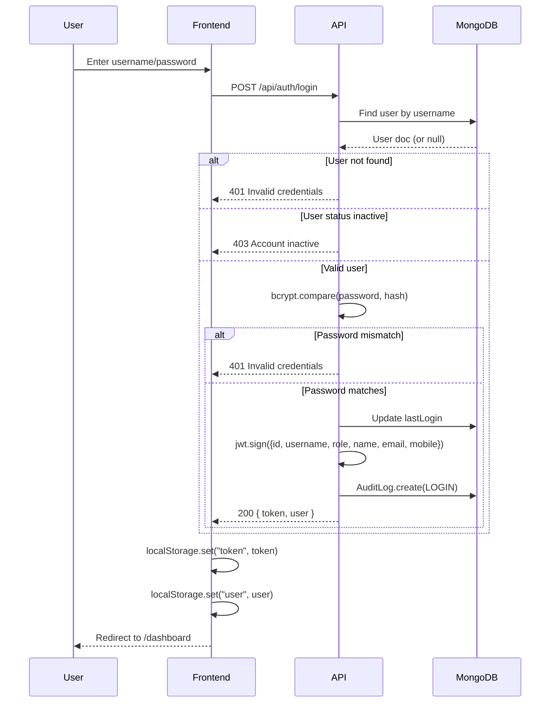
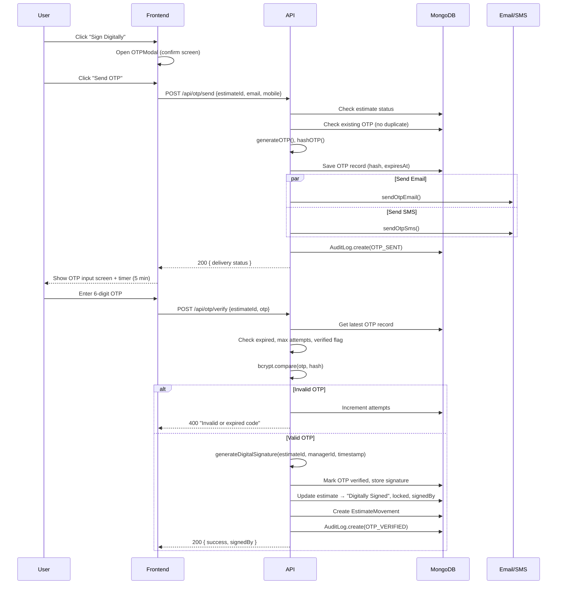
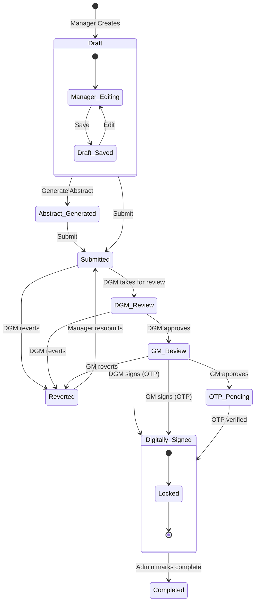
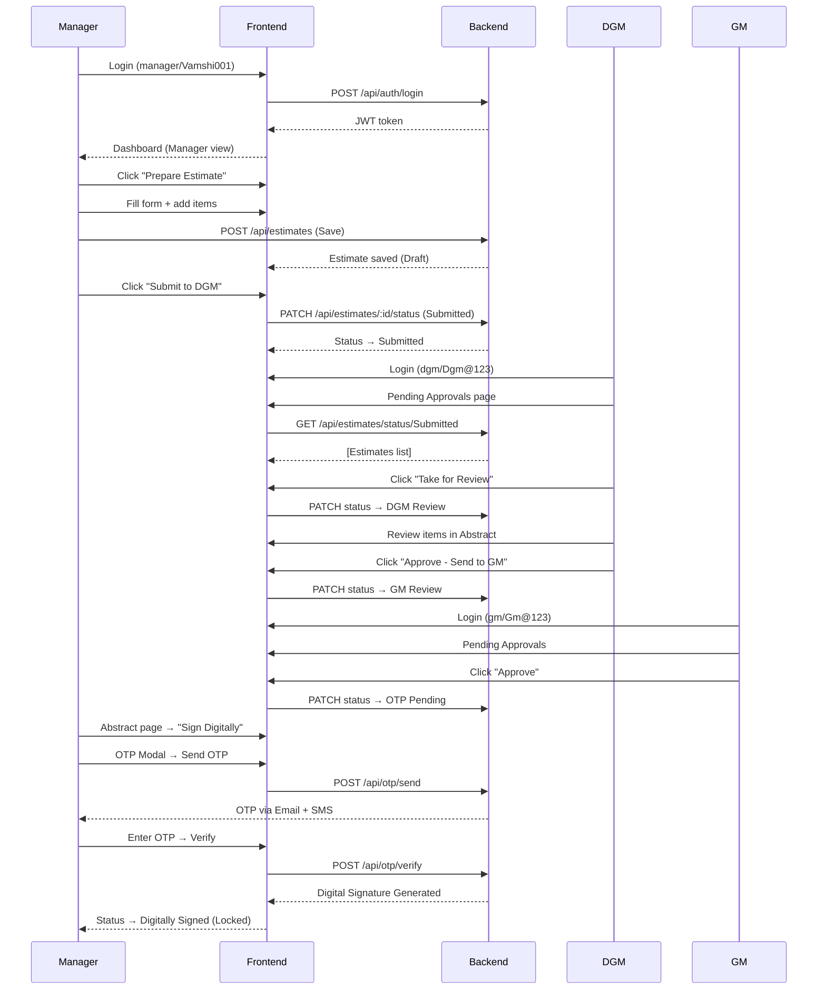
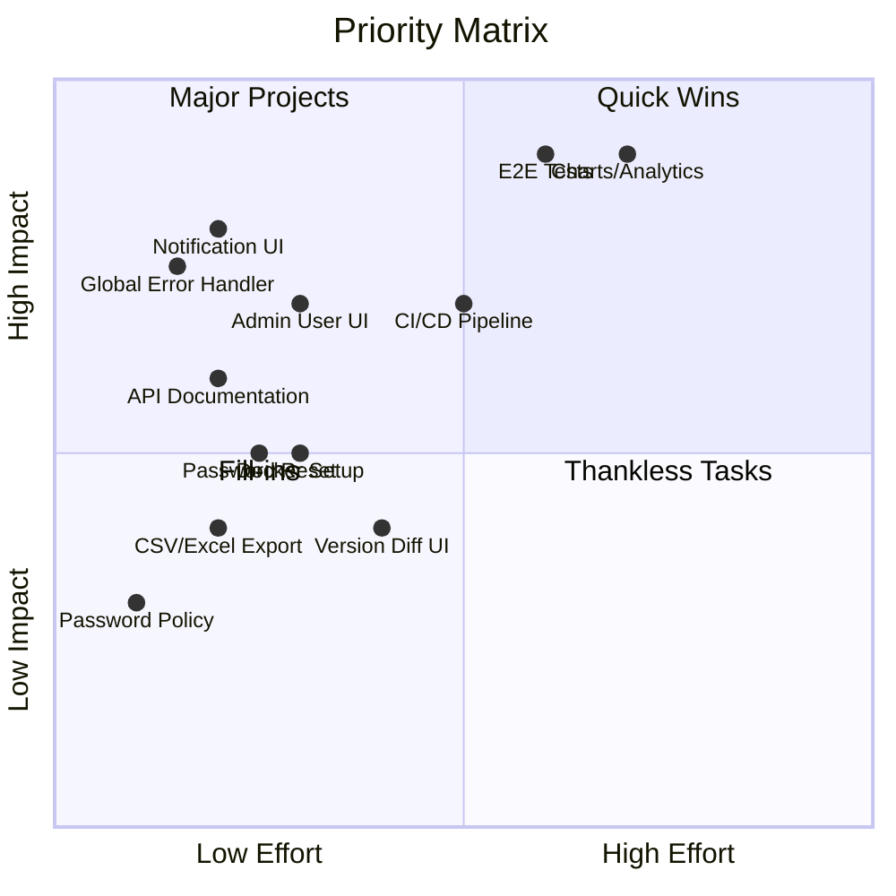

# HMWSSB Digital Signature System — Complete Project Documentation

**Document Version:** 1.0  
**Date:** 2026-07-09  
**Author:** Senior Software Architect / Technical Lead  
**Status:** In Development  

---

## TABLE OF CONTENTS

1. [Project Overview](#1-project-overview)
2. [Project Structure](#2-project-structure)
3. [Technology Stack](#3-technology-stack)
4. [Special Libraries](#4-special-libraries)
5. [Database Analysis](#5-database-analysis)
6. [API Documentation](#6-api-documentation)
7. [Authentication System](#7-authentication-system)
8. [Authorization](#8-authorization)
9. [Security Audit](#9-security-audit)
10. [Workflow Analysis](#10-workflow-analysis)
11. [Business Logic](#11-business-logic)
12. [Frontend Analysis](#12-frontend-analysis)
13. [Backend Analysis](#13-backend-analysis)
14. [Configuration](#14-configuration)
15. [File Storage](#15-file-storage)
16. [Digital Signature Module](#16-digital-signature-module)
17. [Error Handling](#17-error-handling)
18. [Performance Analysis](#18-performance-analysis)
19. [Code Quality](#19-code-quality)
20. [Current Work Progress](#20-current-work-progress)
21. [Remaining Work](#21-remaining-work)
22. [Bugs Found](#22-bugs-found)
23. [Testing Status](#23-testing-status)
24. [Deployment](#24-deployment)
25. [Future Improvements](#25-future-improvements)
26. [Final Project Score](#26-final-project-score)
27. [Executive Summary](#27-executive-summary)
28. [Appendix: Key Files Reference](#28-appendix-key-files-reference)

---

## 1. PROJECT OVERVIEW

### Project Name
**HMWSSB Digital Signature System** (Hyderabad Metropolitan Water Supply & Sewerage Board Works Management Module)

### Purpose
A web-based application to digitize the entire workflow of estimate preparation, approval, and digital signing for HMWSSB infrastructure works. The system replaces paper-based approvals with a secure, auditable digital workflow.

### Business Problem
- Manual paper-based estimate processing is slow, error-prone, and lacks traceability
- No centralized system for tracking estimate lifecycles
- Approval hierarchies are managed offline, causing delays
- No digital signature mechanism for official approvals
- Audit trail is non-existent or fragmented

### Solution
A full-stack web application providing:
- Role-based estimate creation and management
- Multi-level digital approval workflow (Manager → DGM → GM)
- OTP-based digital signature verification
- Automated PDF abstract generation
- Complete audit logging and version history
- Reports with CSV export
- Email and SMS notification delivery

### Main Features
| Feature | Status | Notes |
|---------|--------|-------|
| User Authentication (JWT) | ✅ Complete | Username/password with role-based access |
| Role-Based Access Control | ✅ Complete | 5 roles: admin, manager, dgm, gm, viewer |
| Estimate Creation & Management | ✅ Complete | Full CRUD with draft save |
| Item Master | ✅ Complete | 29 seeded items, searchable |
| Administrative Hierarchy | ✅ Complete | Region → Zone → Circle → Ward |
| Estimate Movement (Status Tracking) | ✅ Complete | Full state machine |
| Estimate Version History | ✅ Complete | Snapshot-based |
| PDF Abstract Generation | ✅ Complete | Playwright HTML→PDF |
| OTP Send & Verify | ✅ Complete | Email + SMS delivery |
| Digital Signature Generation | ✅ Complete | SHA-256 based |
| Audit Logging | ✅ Complete | All actions logged |
| Reports with Filters | ✅ Complete | With summary & CSV export |
| Dashboard | ✅ Complete | Role-specific cards |
| Pending Approvals View | ✅ Complete | DGM/GM specific |
| Notifications | ⚠️ Partially | Model exists, UI/API not integrated |
| Excel Export | ✅ Complete | CSV export implemented |
| Admin User Management | ⚠️ Partially | Create user, list users APIs exist |
| Admin Item Management | ⚠️ Partially | CRUD APIs exist, UI not fully integrated |

### Target Users
| Role | Division | Permissions |
|------|----------|-------------|
| Admin | System Administration | Full access |
| Manager | Field Operations | Create/edit own estimates |
| DGM | Deputy General Manager | Review, approve, revert |
| GM | General Manager | Final review, OTP trigger |
| Viewer | Read-Only | View reports and estimates |

### Current Development Stage
**Alpha — Functional Foundation Phase (~65% complete)**

The core workflow is implemented: authentication, estimate creation, approval flow (Draft → Submitted → DGM Review → GM Review → OTP Pending → Digitally Signed), PDF generation, and audit logging. Some admin features, notification integration, and comprehensive testing remain.

### Overall Architecture



---

## 2. PROJECT STRUCTURE

### Complete Directory Tree

```
C:\Users\vamsh\hmwssb-digital-signature\
├── READ.md\                         (empty directory — possible typo)
├── TODO.md                          (implementation todo list)
├── client\                          (React frontend)
│   ├── .gitignore
│   ├── .oxlintrc.json               (Oxlint config)
│   ├── index.html                   (Vite entry HTML)
│   ├── package.json
│   ├── package-lock.json
│   ├── vite.config.js
│   ├── public\
│   │   ├── favicon.svg
│   │   └── icons.svg
│   ├── dist\                        (production build output)
│   │   ├── index.html
│   │   ├── favicon.svg
│   │   ├── icons.svg
│   │   └── assets\                  (chunked JS/CSS)
│   └── src\
│       ├── main.jsx                 (React entry)
│       ├── App.jsx                  (Router + Lazy routes)
│       ├── App.css
│       ├── index.css
│       ├── assets\                  (images)
│       │   ├── hero.png
│       │   ├── react.svg
│       │   └── vite.svg
│       ├── components\
│       │   ├── DashboardCard\       (dashboard card UI)
│       │   ├── EstimateForm\        (estimate metadata form)
│       │   ├── Loader\              (empty)
│       │   ├── MaterialTable\       (items entry table)
│       │   ├── Modal\               (empty)
│       │   ├── Navbar\              (navigation bar)
│       │   ├── OTP\                 (OTP modal, input, timer)
│       │   ├── ProfileCard\         (empty)
│       │   ├── RecentActivity\      (empty)
│       │   ├── Sidebar\             (empty)
│       │   └── StatsCard\           (empty)
│       ├── context\                 (empty)
│       ├── hooks\                   (empty)
│       ├── pages\
│       │   ├── AbstractWorkspace\   (PDF preview/actions)
│       │   ├── Approval\            (empty)
│       │   ├── Dashboard\           (role-based dashboard)
│       │   ├── EstimateList\        (estimate listing)
│       │   ├── Login\               (login form)
│       │   ├── PendingApprovals\    (DGM/GM approval UI)
│       │   ├── PrepareEstimate\     (estimate creation)
│       │   └── Reports\             (reporting UI)
│       ├── services\
│       │   └── api.js               (Axios API client)
│       ├── styles\
│       │   └── global.css           (global styles)
│       └── utils\
│           └── estimateUtils.js     (calculation helpers)
│
├── docs\                            (documentation)
│   ├── COMPREHENSIVE_PROJECT_DOCUMENTATION.md   (THIS FILE)
│   ├── DEVELOPER_HANDOFF_PLAN.md
│   ├── EXECUTIVE_SUMMARY.md
│   ├── MASTER_IMPLEMENTATION_BLUEPRINT.md
│   └── PROJECT_PROGRESS_DOCUMENT.md
│
└── server\                          (Express backend)
    ├── .env                         (environment variables)
    ├── .env.example                 (env template)
    ├── app.js                       (Express app setup)
    ├── package.json
    ├── server.js                    (server entry + seeding)
    ├── config\
    │   └── db.js                    (MongoDB connection)
    ├── controllers\
    │   ├── authController.js        (login, profile, user mgmt)
    │   ├── estimateController.js    (CRUD + status/versions)
    │   ├── hierarchyController.js   (region/zone/circle/ward)
    │   ├── itemController.js        (item CRUD + search)
    │   ├── otpController.js         (send/verify OTP)
    │   ├── pdfController.js         (generate/serve PDF)
    │   ├── reportController.js      (filters, reports, CSV)
    │   └── seedHierarchy.js         (hierarchy data seeder)
    ├── middleware\
    │   └── authMiddleware.js        (JWT verify + role guard)
    ├── models\
    │   ├── index.js                 (model barrel export)
    │   ├── Abstract.js              (abstract metadata)
    │   ├── AuditLog.js              (audit trail)
    │   ├── Circle.js                (administrative circle)
    │   ├── Estimate.js              (estimate document)
    │   ├── EstimateItem.js          (estimate line items)
    │   ├── EstimateMovement.js      (status transition log)
    │   ├── EstimateVersion.js       (version snapshots)
    │   ├── Item.js                  (item master catalog)
    │   ├── Notification.js          (user notifications)
    │   ├── Otp.js                   (OTP records)
    │   ├── Region.js                (administrative region)
    │   ├── User.js                  (user accounts)
    │   ├── Ward.js                  (administrative ward)
    │   ├── WorkMaster.js            (work master registry)
    │   └── Zone.js                  (administrative zone)
    ├── routes\
    │   ├── authRoutes.js
    │   ├── estimateRoutes.js
    │   ├── hierarchyRoutes.js
    │   ├── itemRoutes.js
    │   ├── otpRoutes.js
    │   ├── pdfRoutes.js
    │   └── reportRoutes.js
    ├── seeders\
    │   └── hierarchyData.js         (HMC region data: 12 zones, 72 circles, 813 wards)
    ├── services\
    │   ├── authService.js           (hash, JWT sign/verify)
    │   ├── otpService.js            (generate, hash, verify OTP)
    │   └── pdfService.js            (Playwright PDF generation)
    ├── tests\
    │   ├── authService.test.js      (hash/compare test)
    │   └── otpService.test.js       (OTP gen/hash/sig test)
    ├── uploads\                     (generated PDF storage)
    └── node_modules\
```

### Folder-by-Folder Analysis

#### `client/` — Frontend Application
- **Purpose**: React SPA with Vite build tool, Bootstrap 5 styling, Axios HTTP client
- **Files**: 36 source files (JSX, CSS, JS), 13 built assets in `dist/`
- **Responsibilities**: All UI rendering, client-side routing, form handling, API integration
- **Dependencies**: React 19, React Router v7, Axios, Bootstrap 5, jsPDF, React Icons, React Toastify

#### `server/` — Backend API
- **Purpose**: Express 5 REST API with MongoDB/Mongoose, JWT auth, OTP, PDF generation
- **Files**: 41 source files (JS, JSON, env), 4 generated PDFs in uploads/
- **Responsibilities**: Authentication, CRUD, workflow state machine, PDF generation, OTP, email/SMS
- **Dependencies**: Express 5, Mongoose 9, bcrypt, jsonwebtoken, nodemailer, twilio, playwright

#### `docs/` — Documentation
- **Purpose**: Project documentation and planning artifacts

#### Empty/Dead Folders
| Folder | Status |
|--------|--------|
| `client/src/components/Buttons/` | Empty |
| `client/src/components/Loader/` | Empty |
| `client/src/components/Modal/` | Empty |
| `client/src/components/ProfileCard/` | Empty |
| `client/src/components/RecentActivity/` | Empty |
| `client/src/components/Sidebar/` | Empty |
| `client/src/components/StatsCard/` | Empty |
| `client/src/context/` | Empty |
| `client/src/hooks/` | Empty |
| `client/src/pages/Approval/` | Empty |
| `client/READ.md/` | Empty directory (typo) |

---

## 3. TECHNOLOGY STACK

### Frontend

| Technology | Version | Why Used | Advantages | Alternative |
|-----------|---------|----------|------------|-------------|
| React | 19.2.7 | Component-based UI, large ecosystem | Virtual DOM, hooks, lazy loading | Vue 3, Svelte, Solid |
| Vite | 8.1.1 | Fast build tool for modern web | HMR, ESM-native, fast builds | Webpack, Turbopack, Rollup |
| React Router | 7.18.1 | Client-side routing | Lazy loading, protected routes | TanStack Router, Next.js Router |
| Axios | 1.18.1 | HTTP client | Interceptors, request/response transform | Fetch API, ky, got |
| Bootstrap | 5.3.8 | CSS framework | Responsive grid, components, utilities | Tailwind CSS, Material UI |
| React Icons | 5.7.0 | Icon library | Tree-shakeable, popular icon sets | Lucide, Heroicons |
| React Toastify | 11.1.0 | Toast notifications | Customizable, auto-close, themes | Sonner, notistack |
| jsPDF | 2.5.1 | Client-side PDF generation | Autotable plugin, text formatting | pdf-lib, PDFKit (server) |

### Backend

| Technology | Version | Why Used | Advantages | Alternative |
|-----------|---------|----------|------------|-------------|
| Express | 5.2.1 | Node.js web framework | Mature, minimal, middleware ecosystem | Fastify, Hono, Koa |
| Mongoose | 9.7.3 | MongoDB ODM | Schema validation, middleware, population | Prisma, TypeORM, native driver |
| bcrypt | 6.0.0 | Password hashing | Adaptive salt, proven security | argon2, scrypt |
| jsonwebtoken | 9.0.3 | JWT auth | Stateless, standard, widely adopted | jose, passport-jwt |
| dotenv | 17.4.2 | Environment variables | Zero-config, .env loading | cross-env, env-cmd |
| cors | 2.8.6 | CORS middleware | Simple config | Custom middleware |
| Helmet | 8.2.0 | Security headers | 15 security headers, easy setup | lusca |
| express-rate-limit | 8.5.2 | Rate limiting | Memory-based, configurable | express-brute, rate-limiter-flexible |
| nodemailer | 9.0.3 | Email sending | SMTP support, HTML templates | sendmail, mailgun-js |
| twilio | 6.0.2 | SMS sending | Reliable, global SMS | Vonage, Plivo |
| Playwright | 1.40.0 | PDF generation | Headless browser, full CSS support | Puppeteer, pdfkit |
| Nodemon | 3.1.14 | Dev auto-restart | File watch, reliable | tsx, node --watch |

### Database

| Technology | Version | Why Used | Advantages | Alternative |
|-----------|---------|----------|------------|-------------|
| MongoDB | 7+ | NoSQL document store | Schema flexibility, JSON-native, scaling | PostgreSQL, MySQL |
| Mongoose | 9.7.3 | MongoDB ODM | Validation, middleware, population | Prisma, TypeORM |
| Connection: `mongodb://127.0.0.1:27017/hmwssb` | | | | |

### Other Infrastructure

| Component | Technology |
|-----------|-----------|
| Runtime | Node.js (ES Modules) |
| Package Manager | npm |
| Version Control | Git (no .git repo detected) |
| Linting | oxlint (Rust-based linter) |
| Testing | Node.js built-in `node:test` |
| Build | Vite (frontend), Node (backend) |

---

## 4. SPECIAL LIBRARIES

### Server Dependencies

| Library | Version | Purpose | Where Used | Importance | Removable? |
|---------|---------|---------|------------|------------|------------|
| express | 5.2.1 | Web framework | app.js, all routes | Critical | No |
| mongoose | 9.7.3 | MongoDB ODM | All models, config/db.js | Critical | No |
| bcrypt | 6.0.0 | Password hashing | User model, authService.js | Critical | No |
| jsonwebtoken | 9.0.3 | JWT sign/verify | authService.js, authMiddleware.js | Critical | No |
| dotenv | 17.4.2 | Env variables | server.js | Critical | No |
| cors | 2.8.6 | CORS | app.js | Critical | No |
| helmet | 8.2.0 | Security headers | app.js | Critical | No |
| express-rate-limit | 8.5.2 | Rate limiting | app.js (login/OTP) | Critical | No |
| nodemailer | 9.0.3 | Email delivery | emailService.js | Optional* | Yes (with fallback) |
| twilio | 6.0.2 | SMS delivery | smsService.js | Optional* | Yes (with fallback) |
| playwright | 1.40.0 | PDF generation | pdfService.js | Critical (PDF) | Yes (if PDF removed) |
| nodemon | 3.1.14 | Dev server restart | package.json scripts | Dev only | Yes |

*\*Email/SMS have graceful fallbacks when not configured.*

### Client Dependencies

| Library | Version | Purpose | Where Used | Importance | Removable? |
|---------|---------|---------|------------|------------|------------|
| react | 19.2.7 | UI framework | main.jsx, all components | Critical | No |
| react-dom | 19.2.7 | DOM rendering | main.jsx | Critical | No |
| react-router-dom | 7.18.1 | Routing | App.jsx | Critical | No |
| axios | 1.18.1 | HTTP client | services/api.js | Critical | No |
| bootstrap | 5.3.8 | CSS framework | main.jsx, all components | Critical | No |
| react-toastify | 11.1.0 | Notifications | App.jsx | Medium | Yes (with alert replacement) |
| react-icons | 5.7.0 | Icons | Dashboard, Navbar | Low | Yes |
| jspdf | 2.5.1 | Client PDF | (bundled, unused in source) | Dead dependency | Yes |
| jspdf-autotable | 3.5.28 | PDF tables | (bundled, unused in source) | Dead dependency | Yes |
| @vitejs/plugin-react | 6.0.3 | Vite React plugin | vite.config.js | Build only | No |
| vite | 8.1.1 | Build tool | dev/build scripts | Build only | No |
| oxlint | 1.71.0 | Linter | lint script | Dev only | Yes |

**Dead Dependency**: `jspdf` and `jspdf-autotable` are installed in client `package.json` but never imported in any source file. PDF generation happens server-side via Playwright.

---

## 5. DATABASE ANALYSIS

### Database: `hmwssb` (MongoDB)
**Connection**: `mongodb://127.0.0.1:27017/hmwssb`

### Collections (15 total)

#### 1. `users`
| Field | Type | Required | Unique | Notes |
|-------|------|----------|--------|-------|
| employeeId | String | ✅ | ✅ | e.g., "EMP-ADM-001" |
| username | String | ✅ | ✅ | lowercase, 3-50 chars |
| password | String | ✅ | | bcrypt hashed (min 8 chars) |
| name | String | ✅ | | Max 100 chars |
| email | String | ✅ | ✅ | lowercase |
| mobile | String | ✅ | | |
| designation | String | | | |
| role | String | ✅ | | enum: admin, manager, dgm, gm, viewer |
| region | String | | | |
| zone | String | | | |
| division | String | | | |
| circle | String | | | |
| ward | String | | | |
| profileImage | String | | | |
| status | String | | | enum: active, inactive, suspended |
| lastLogin | Date | | | |
| **Indexes** | | `role`, `status`, `{region, zone, division}` | | |

**Seeded Users:**
| Username | Role | Password |
|----------|------|----------|
| admin | admin | Admin@123 |
| manager | manager | Vamshi001 |
| dgm | dgm | Dgm@123 |
| gm | gm | Gm@123 |
| viewer | viewer | Viewer@123 |

#### 2. `items`
| Field | Type | Required | Unique | Notes |
|-------|------|----------|--------|-------|
| itemCode | String | ✅ | ✅ | e.g., "MAT-001" |
| name | String | ✅ | | Max 200 chars |
| description | String | | | Max 500 chars |
| category | String | ✅ | | enum: Material, Civil |
| unit | String | ✅ | | e.g., "Bag", "Meter" |
| rate | Number | ✅ | | Min 0 |
| gst | Number | | | enum: 0, 5, 12, 18, 28 |
| status | String | | | enum: active, inactive |
| createdBy | ObjectId | | | ref: User |
| **Indexes** | | `{name, description}` (text), `{category, status}`, `status` | | |

**Seeded: 29 items** (16 Material, 9 Civil)

#### 3. `estimates`
| Field | Type | Required | Unique | Notes |
|-------|------|----------|--------|-------|
| estimateId | String | ✅ | ✅ | e.g., "EST-1783549854124" |
| workId | ObjectId | | | ref: WorkMaster |
| nameOfWork | String | ✅ | | Max 500 chars |
| region | String | | | |
| zone | String | | | |
| division | String | | | |
| circle | String | | | |
| ward | String | | | |
| managerId | ObjectId | | | ref: User |
| managerName | String | | | |
| version | String | | | Default "V1.0" |
| status | String | | | 10-state enum (see below) |
| materialCost | Number | | | |
| civilCost | Number | | | |
| subtotal | Number | | | |
| gstPercent | Number | | | |
| gstAmount | Number | | | |
| lsAmount | Number | | | Lump Sum amount |
| grandTotal | Number | | | |
| pdfUrl | String | | | |
| digitalSignature | String | | | SHA-256 hex |
| signedBy | Mixed | | | {userId, name, role, designation} |
| signedAt | Date | | | |
| remarks | String | | | Max 1000 |
| items | [ObjectId] | | | ref: EstimateItem |
| lastMovement | ObjectId | | | ref: EstimateMovement |
| estimateMovements | [ObjectId] | | | ref: EstimateMovement |
| currentVersion | ObjectId | | | ref: EstimateVersion |
| locked | Boolean | | | Default false |
| **Indexes** | | `status`, `managerId`, `workId`, `{region, zone, division}`, `createdAt`, `grandTotal` | | |

**Status Enum (10 states):**
```
Draft → Abstract Generated → Submitted → DGM Review → Reverted → Resubmitted → GM Review → OTP Pending → Digitally Signed → Completed
```

#### 4. `estimateitems`
| Field | Type | Required | Notes |
|-------|------|----------|-------|
| estimateId | String | ✅ | |
| itemId | ObjectId | | ref: Item |
| category | String | | enum: Material, Civil |
| material | String | ✅ | |
| description | String | | |
| unit | String | | Default "Nos" |
| rate | Number | | Min 0 |
| n | Number | | Length dimension |
| l | Number | | Length dimension |
| b | Number | | Breadth dimension |
| d | Number | | Depth dimension |
| qty | Number | | Calculated: n × l × b × d |
| gst | Number | | enum: 0, 5, 12, 18, 28 |
| amount | Number | | Calculated |
| **Indexes** | | `estimateId`, `itemId` | |

#### 5. `estimatemovements`
| Field | Type | Required | Notes |
|-------|------|----------|-------|
| estimateId | String | ✅ | |
| fromStatus | String | ✅ | |
| toStatus | String | ✅ | |
| action | String | ✅ | |
| actorId | ObjectId | | ref: User |
| actorName | String | | |
| actorRole | String | | |
| comments | String | | Max 1000 |
| **Indexes** | | `{estimateId, createdAt}`, `actorId`, `action`, `createdAt` | |

#### 6. `estimateversions`
| Field | Type | Required | Notes |
|-------|------|----------|-------|
| estimateId | String | ✅ | |
| version | String | ✅ | e.g., "V1.0" |
| previousVersion | String | | |
| createdBy | ObjectId | | ref: User |
| snapshot | Mixed | | Full estimate + items snapshot |
| **Indexes** | | `{estimateId, version}`, `createdBy`, `createdAt` | |

#### 7. `otps`
| Field | Type | Required | Notes |
|-------|------|----------|-------|
| estimateId | String | ✅ | |
| managerId | ObjectId | ✅ | ref: User |
| email | String | | |
| mobile | String | | |
| otpHash | String | ✅ | bcrypt hash |
| attempts | Number | | Min 0, Max 3 |
| verified | Boolean | | |
| signature | String | | SHA-256 digital signature |
| expiresAt | Date | ✅ | 5 min from creation |
| emailSent | Boolean | | |
| smsSent | Boolean | | |
| **TTL Index** | | `expiresAt` (expireAfterSeconds: 0) | Auto-deletes expired records |

#### 8. `auditlogs`
| Field | Type | Required | Notes |
|-------|------|----------|-------|
| userId | ObjectId | | ref: User |
| actorName | String | | |
| actorRole | String | | |
| entity | String | | |
| entityId | String | | |
| action | String | ✅ | |
| module | String | | |
| description | String | | |
| ip | String | | |
| userAgent | String | | |
| details | Mixed | | Arbitrary metadata |
| **Indexes** | | `entityId`, `userId`, `action`, `createdAt`, `entity` | |

#### 9. `abstracts`
| Field | Type | Required | Notes |
|-------|------|----------|-------|
| estimateId | String | ✅ | |
| estimateRef | ObjectId | | ref: Estimate |
| materialCost | Number | | |
| civilCost | Number | | |
| gstAmount | Number | | |
| lsAmount | Number | | |
| grandTotal | Number | | |
| pdfPath | String | | File path on disk |
| generatedBy | ObjectId | | ref: User |
| **Indexes** | | `estimateId`, `generatedBy`, `createdAt` | |

#### 10. `notifications`
| Field | Type | Required | Notes |
|-------|------|----------|-------|
| userId | ObjectId | ✅ | ref: User |
| title | String | ✅ | Max 200 |
| message | String | ✅ | Max 1000 |
| type | String | | enum: info, success, warning, error |
| read | Boolean | | Default false |
| **Indexes** | | `{userId, read}`, `createdAt`, `read` | |

#### 11. `regions`
| Field | Type | Notes |
|-------|------|-------|
| name | String | Required, unique, e.g., "HMC" |
| code | String | |
| status | String | active/inactive |

#### 12. `zones`
| Field | Type | Notes |
|-------|------|-------|
| name | String | Required, e.g., "Rajendranagar" |
| region | ObjectId | ref: Region |
| zoneNo | Number | 1-12 |
| status | String | active/inactive |

#### 13. `circles`
| Field | Type | Notes |
|-------|------|-------|
| circleNo | Number | 1-72 |
| name | String | Required |
| zone | ObjectId | ref: Zone |
| status | String | active/inactive |

#### 14. `wards`
| Field | Type | Notes |
|-------|------|-------|
| wardNo | Number | 813 wards |
| name | String | Required |
| circle | ObjectId | ref: Circle |
| status | String | active/inactive |

#### 15. `workmasters`
| Field | Type | Notes |
|-------|------|-------|
| workId | String | Required, unique |
| workName | String | Required, max 500 |
| region/zone/division/circle/ward | String | |
| location | String | |
| workType | String | |
| status | String | active/inactive/completed/cancelled |

### Entity-Relationship Diagram



---

## 6. API DOCUMENTATION

### Authentication APIs

| Method | Endpoint | Controller | Auth | Roles | Description |
|--------|----------|------------|------|-------|-------------|
| POST | `/api/auth/login` | authController.login | No | All | Login, returns JWT |
| GET | `/api/auth/profile` | authController.getProfile | JWT | All | Get current user profile |
| GET | `/api/auth/users` | authController.listUsers | JWT | admin | List all users |
| POST | `/api/auth/users` | authController.createUser | JWT | admin | Create new user |
| PATCH | `/api/auth/users/:id/status` | authController.updateUserStatus | JWT | admin | Update user status |

**POST /api/auth/login**
- Body: `{ username, password }`
- Success: `{ success: true, token, user }`
- Error 401: Invalid credentials
- Error 403: Account inactive
- Rate limited: 10 req/15min

### OTP APIs

| Method | Endpoint | Controller | Auth | Roles | Description |
|--------|----------|------------|------|-------|-------------|
| POST | `/api/otp/send` | otpController.sendOTP | JWT | dgm, gm | Send OTP via email+SMS |
| POST | `/api/otp/verify` | otpController.verifyOTP | JWT | dgm, gm | Verify OTP, generate signature |

**POST /api/otp/send**
- Body: `{ estimateId, email, mobile }`
- Guards: Estimate must be in "OTP Pending", "DGM Review" (for DGM), or "GM Review" (for GM) status
- Rate limited: 5 req/15min
- Validates: No existing unexpired OTP

**POST /api/otp/verify**
- Body: `{ estimateId, otp }`
- Guards: 6-digit OTP, not expired, max 3 attempts, not already verified
- On success: Status → "Digitally Signed", estimate locked, SHA-256 signature stored

### Estimate APIs

| Method | Endpoint | Controller | Auth | Roles | Description |
|--------|----------|------------|------|-------|-------------|
| POST | `/api/estimates` | estimateController.createEstimate | JWT | admin, manager | Create estimate |
| GET | `/api/estimates` | estimateController.getEstimates | JWT | All | List estimates (filtered) |
| GET | `/api/estimates/:id` | estimateController.getEstimateById | JWT | All | Get estimate by ID |
| PATCH | `/api/estimates/:id` | estimateController.updateEstimate | JWT | admin, manager | Update estimate |
| PATCH | `/api/estimates/:id/status` | estimateController.updateEstimateStatus | JWT | admin, manager, dgm, gm | Change status |
| GET | `/api/estimates/:id/movements` | estimateController.getEstimateMovements | JWT | All | Get movement history |
| POST | `/api/estimates/:id/versions` | estimateController.createEstimateVersion | JWT | admin, manager | Create version snapshot |
| GET | `/api/estimates/status/:status` | estimateController.getEstimatesByStatus | JWT | All | Filter by status |

**Query Parameters for GET /api/estimates:**
- `page` (default 1), `limit` (default 20)
- `status`, `zone`
- Role-based filtering: manager sees own, DGM sees Submitted/DGM Review, GM sees GM Review

**PATCH /api/estimates/:id/status — Valid Transitions:**
```
Draft → Abstract Generated, Submitted
Abstract Generated → Submitted
Submitted → DGM Review, Reverted
DGM Review → GM Review, Reverted, Digitally Signed
GM Review → OTP Pending, Reverted, Digitally Signed
Reverted → Submitted
OTP Pending → Digitally Signed
Digitally Signed → Completed
```

### Item APIs

| Method | Endpoint | Auth | Roles | Description |
|--------|----------|------|-------|-------------|
| GET | `/api/items/search?q=` | JWT | All | Search items (regex) |
| GET | `/api/items` | JWT | All | List items (filterable) |
| GET | `/api/items/:id` | JWT | All | Get item by ID |
| POST | `/api/items` | JWT | admin | Create item |
| PUT | `/api/items/:id` | JWT | admin | Update item |

### PDF APIs

| Method | Endpoint | Auth | Description |
|--------|----------|------|-------------|
| POST | `/api/pdf/abstract` | JWT | Generate abstract PDF (returns binary) |
| GET | `/api/pdf/abstract/:estimateId` | JWT | Serve existing abstract PDF |

### Report APIs

| Method | Endpoint | Auth | Description |
|--------|----------|------|-------------|
| GET | `/api/reports/filters` | JWT | Get distinct filter values |
| GET | `/api/reports` | JWT | Get filtered reports |
| GET | `/api/reports/export` | JWT | Export CSV |
| GET | `/api/reports/audit-logs` | JWT | Get audit logs |

### Hierarchy APIs

| Method | Endpoint | Auth | Description |
|--------|----------|------|-------------|
| GET | `/api/hierarchy/regions` | JWT | Active regions |
| GET | `/api/hierarchy/zones` | JWT | Active zones (populated) |
| GET | `/api/hierarchy/zones/:zoneId/circles` | JWT | Circles by zone |
| GET | `/api/hierarchy/circles/:circleId/wards` | JWT | Wards by circle |

### Health Check

| Method | Endpoint | Auth | Description |
|--------|----------|------|-------------|
| GET | `/api/health` | No | Server health check |

---

## 7. AUTHENTICATION SYSTEM

### Login Flow



### Registration
**Not Implemented** — Users are seeded via `seedUsers()` on server start. Admin can create users via `POST /api/auth/users` API (admin-only).

### OTP Flow



### JWT Token Details
- **Algorithm**: HS256
- **Secret Source**: `process.env.JWT_SECRET` (min 32 chars, validated on startup)
- **Expiry**: 8 hours
- **Payload**: `{ id, username, role, name, email, mobile, iat, exp }`
- **Transport**: `Authorization: Bearer <token>` header
- **Storage**: `localStorage` (client side)

### Token Validation
```js
// authMiddleware.js
const decoded = verifyToken(token);  // jwt.verify with secret
req.user = decoded;                   // Attach to request
next();
```

### Token Expiry Check (Frontend)
```js
// App.jsx
const isTokenExpired = (token) => {
  const payload = JSON.parse(atob(token.split('.')[1]));
  return payload.exp * 1000 < Date.now();
};
```

### Auto-redirect on 401
The Axios interceptor in `api.js` automatically removes token and redirects to `/login` on 401 responses (except for login requests).

---

## 8. AUTHORIZATION

### Roles

| Role | Priority | Description |
|------|----------|-------------|
| `admin` | 0 (highest) | System administrator — full access |
| `manager` | 1 | Field officer — creates and manages own estimates |
| `dgm` | 2 | Deputy General Manager — reviews and approves |
| `gm` | 3 | General Manager — final approval and OTP trigger |
| `viewer` | 4 (lowest) | Read-only access |

### Permission Matrix

| Resource | Action | admin | manager | dgm | gm | viewer |
|----------|--------|-------|---------|-----|------|--------|
| Estimate | Create | ✅ | ✅ | | | |
| Estimate | View own | ✅ | ✅ | ✅ | ✅ | ✅ |
| Estimate | View all | ✅ | | | | |
| Estimate | Edit (Draft) | ✅ | Own only | | | |
| Estimate | Change Status | ✅ | ✅ | ✅ | ✅ | |
| Estimate | Submit | ✅ | ✅ | | | |
| Estimate | Review (DGM) | ✅ | | ✅ | | |
| Estimate | Review (GM) | ✅ | | | ✅ | |
| Estimate | Sign (OTP) | | | ✅ | ✅ | |
| Item | CRUD | ✅ | | | | |
| User | CRUD | ✅ | | | | |
| Reports | View | ✅ | ✅ | ✅ | ✅ | ✅ |
| Reports | Export CSV | ✅ | ✅ | ✅ | ✅ | ✅ |

### Route Protection

```mermaid
graph LR
    REQ[Request] --> AUTH[authMiddleware]
    AUTH -- No Token --> 401[401 Unauthorized]
    AUTH -- Valid Token --> RBAC[authorize(...roles)]
    RBAC -- Not Authorized --> 403[403 Forbidden]
    RBAC -- Authorized --> CTRL[Controller]
```

### Implementation

**authMiddleware.js** provides two middleware functions:
1. `authMiddleware` — Verifies JWT, sets `req.user`
2. `authorize(...allowedRoles)` — Returns middleware that checks `req.user.role`

Usage pattern:
```js
router.patch('/:id/status', authMiddleware, authorize('admin', 'manager', 'dgm', 'gm'), updateEstimateStatus);
```

---

## 9. SECURITY AUDIT

### OWASP Top 10 Analysis

| # | Category | Status | Details |
|---|----------|--------|---------|
| A01 | Broken Access Control | ⚠️ Medium | Role checks are in middleware but some endpoints lack fine-grained ownership checks |
| A02 | Cryptographic Failures | ✅ Good | bcrypt for passwords, SHA-256 for signatures, JWT with secret |
| A03 | Injection | ✅ Good | Mongoose parameterized queries, no raw queries |
| A04 | Insecure Design | ⚠️ Low | Token stored in localStorage (XSS vulnerable) |
| A05 | Security Misconfiguration | ⚠️ Low | Helmet enabled, CORS configured |
| A06 | Vulnerable Components | ✅ Good | Dependencies relatively up-to-date |
| A07 | Identification & Auth Failures | ⚠️ Medium | No account lockout, no MFA |
| A08 | Data Integrity Failures | ✅ Good | Audit logging for all state changes |
| A09 | Logging & Monitoring | ⚠️ Low | Audit logs exist, no centralized monitoring |
| A10 | SSRF | ✅ Good | No server-side request forwarding |

### Critical Issues Found

#### Issue 1: Secrets in Source Code (CRITICAL)
- **File**: `server/.env`
- **Problem**: Contains live credentials (SMTP password, Twilio tokens)
- **Severity**: **CRITICAL**
- **Fix**: `.env` should NEVER be committed to version control. Add to `.gitignore`. Rotate credentials immediately.

#### Issue 2: JWT Secret Too Short Warning
- **File**: `server/.env`
- **Problem**: `JWT_SECRET=hmwssb-prod-jwt-secret-change-this-in-production` (38 chars, but contains dictionary words)
- **Severity**: **Medium**
- **Fix**: Generate cryptographically random secret: `node -e "console.log(require('crypto').randomBytes(32).toString('hex'))"`

#### Issue 3: Token in localStorage (XSS Risk)
- **File**: `client/src/App.jsx`, `client/src/services/api.js`
- **Problem**: JWT stored in `localStorage`, accessible to any JavaScript
- **Severity**: **Medium**
- **Fix**: Use `httpOnly` cookies for token storage, or implement token refresh mechanism

#### Issue 4: No CSRF Protection
- **Problem**: No CSRF tokens implemented
- **Severity**: **Low** (since API uses Bearer tokens, not cookie-based auth)
- **Fix**: Use `sameSite: 'strict'` on cookies if switching to cookie-based auth

#### Issue 5: No Input Sanitization on User-Created Content
- **File**: `authController.js`, `estimateController.js`
- **Problem**: User input stored directly without XSS sanitization
- **Severity**: **Medium**
- **Fix**: Sanitize strings with `xss` library or DOMPurify before storage

#### Issue 6: No Password Complexity Validation on Create/Update
- **File**: `authController.js`
- **Problem**: No validation for password strength on user creation
- **Severity**: **Low**
- **Fix**: Add password policy enforcement (min length, complexity)

#### Issue 7: Error Messages Expose Too Much Detail
- **File**: Multiple controllers
- **Problem**: `error.message` returned directly to client (may leak internal details)
- **Severity**: **Low**
- **Fix**: Log full error server-side, return sanitized message to client

#### Issue 8: No Helmet Configuration for CSP
- **File**: `app.js`
- **Problem**: `app.use(helmet())` uses defaults; no Content Security Policy
- **Severity**: **Low**
- **Fix**: Configure CSP via helmet: `helmet.contentSecurityPolicy({ directives: {...} })`

#### Issue 9: No SQL/Mongo Injection Risk (Good)
- All database queries use Mongoose/MongoDB parameterized queries
- User input is never concatenated into query strings

#### Issue 10: Rate Limiting Present (Good)
- Login: 10 requests per 15 minutes
- OTP: 5 requests per 15 minutes

### Security Score: 72/100

---

## 10. WORKFLOW ANALYSIS

### Complete Estimate Workflow



### User Journey



### State Machine Rules (estimateController.js)

```js
const WORKFLOW_TRANSITIONS = {
  'Draft':             ['Abstract Generated', 'Submitted'],
  'Abstract Generated':['Submitted'],
  'Submitted':         ['DGM Review', 'Reverted'],
  'DGM Review':        ['GM Review', 'Reverted', 'Digitally Signed'],
  'GM Review':         ['OTP Pending', 'Reverted', 'Digitally Signed'],
  'Reverted':          ['Submitted'],
  'OTP Pending':       ['Digitally Signed'],
  'Digitally Signed':  ['Completed'],
  'Completed':         [],
};
```

### Approval Flow Summary

1. **Manager** creates estimate in **Draft** status
2. Manager prepares abstract → **Abstract Generated**
3. Manager **Submits** to DGM
4. **DGM** reviews → can **Approve** (→ GM Review) or **Revert** (→ Reverted) or **Sign Digitally** (via OTP)
5. **GM** reviews → can **Approve** (→ OTP Pending) or **Revert** (→ Reverted) or **Sign Digitally** (via OTP)
6. **Manager/User** verifies OTP → **Digitally Signed** (estimate locked)
7. **Admin** marks → **Completed**

---

## 11. BUSINESS LOGIC

### Core Algorithms

#### Quantity Calculation
```js
// calculateQty.js
qty = n × l × b × d
// Where n, l, b, d are dimensional parameters
```

#### Amount Calculation
```js
// calculateAmount.js
amount = qty × rate × (1 + gstPercent / 100)
```

#### Grand Total
```js
totalAmount = sum of all item amounts
gstTotal = sum of (item.amount × item.gst / 100)
grandTotal = totalAmount + gstTotal + lsAmount
```

#### Digital Signature Generation
```js
// otpService.js
signature = SHA-256(JSON.stringify({ estimateId, managerId, verifiedAt }))
```

### Business Rules

| Rule | Logic | Enforced In |
|------|-------|-------------|
| Unique Estimate ID | `estimateId` must be unique | `Estimate` model (unique: true) |
| Locked Estimate | Cannot edit after "Digitally Signed" | `estimateController.js` (locked check) |
| Status Transitions | Must follow defined state machine | `WORKFLOW_TRANSITIONS` map |
| Role-Based Actions | Only certain roles can trigger certain statuses | `ROLE_TRANSITIONS` map |
| OTP Expiry | 5-minute validity | `Otp` model (`expiresAt`) |
| Max OTP Attempts | 3 attempts before rejection | `Otp` model (`maxAttemptsReached()`) |
| No Duplicate OTP | Cannot send OTP if unexpired one exists | `checkExistingOtp()` |
| Estimate Ownership | Manager can only edit own estimates | `updateEstimate` controller |
| PDF Validation | Rejects PDFs under 50 bytes | `pdfController.js` |

### Validation Rules

| Field | Rule | Enforced By |
|-------|------|-------------|
| Username | 3-50 chars, lowercase | Mongoose schema |
| Password | Min 8 chars | Mongoose schema |
| Email | Unique, lowercase | Mongoose schema + index |
| Employee ID | Required, unique | Mongoose schema |
| Status values | Must be in enum | Mongoose `enum` |
| Estimate nameOfWork | Required, max 500 | Mongoose schema |
| Item rate | Min 0 | Mongoose `min: 0` |
| Item GST | Must be 0, 5, 12, 18, or 28 | Mongoose `enum` |
| OTP | Must be 6 digits | Controller validation |

### Special Cases

1. **Revert Flow**: When DGM/GM reverts an estimate, it goes back to "Reverted" status, allowing the Manager to resubmit. This creates a loop: Submitted → DGM Review → Reverted → Submitted (repeatable).

2. **Digital Signature Bypass**: DGM or GM can directly sign (via OTP) without going through the full "OTP Pending" flow. This is allowed when they are the signing authority for their review stage.

3. **Locked Estimates**: Once "Digitally Signed", estimates are locked (`locked: true`). No edits, no status changes (except admin can mark "Completed").

4. **Offline Fallback**: OTP service has a MongoDB + in-memory store fallback for when the database is disconnected.

---

## 12. FRONTEND ANALYSIS

### Page-by-Page Analysis

#### 1. Login Page (`/login`)
- **File**: `pages/Login/Login.jsx`
- **Purpose**: User authentication
- **Components**: None (self-contained)
- **State**: `username`, `password`, `error`
- **API Call**: `authApi.login()`
- **Validation**: None (server-side)
- **Routing**: Navigates to `/dashboard` on success
- **Error Handling**: Network errors, invalid credentials

#### 2. Dashboard (`/dashboard`)
- **File**: `pages/Dashboard/Dashboard.jsx`
- **Purpose**: Role-based landing page with quick-action cards
- **Components**: `Navbar`
- **State**: Derived from `localStorage` (user)
- **API Calls**: None on mount
- **Role-Specific Cards**:
  - Admin: Prepare Estimate, Item Master, All Estimates, Reports, Settings
  - Manager: Prepare Estimate, My Estimates, Reports
  - DGM: Pending Approvals, All Estimates, Reports
  - GM: Pending Approvals, All Estimates, Reports
  - Viewer: All Estimates, Reports
- **Dead Routes**: `/admin/items`, `/admin/settings` — referenced but no routes configured

#### 3. Prepare Estimate (`/prepare-estimate`)
- **File**: `pages/PrepareEstimate/PrepareEstimate.jsx`
- **Purpose**: Create or edit estimates
- **Components**: `Navbar`, `EstimateForm`, `MaterialTable`
- **State**: `rows[]`, `lsAmount`, `form{}`
- **Draft Persistence**: `localStorage` key `hmwssb-estimate-draft`
- **Edit Mode**: Via `location.state.edit` flag
- **Auto-save Draft**: `useEffect` on every form/rows/lsAmount change

#### 4. EstimateForm Component
- **File**: `components/EstimateForm/EstimateForm.jsx`
- **Purpose**: Estimate metadata form (region, zone, work name, etc.)
- **API Calls**: `hierarchyApi.getRegions()`, `hierarchyApi.getZones()`, `hierarchyApi.getCircles()`, `hierarchyApi.getWards()`, `estimateApi.create()`
- **Cascading Dropdowns**: Region → Zone → Circle → Ward
- **Validation**: Requires at least one valid item row

#### 5. MaterialTable Component
- **File**: `components/MaterialTable/MaterialTable.jsx`
- **Purpose**: Line items entry with N/L/B/D calculations
- **API Calls**: `itemApi.getAll()`, `estimateApi.create()`, `estimateApi.update()`
- **Features**:
  - Dynamic row add/delete
  - N×L×B×D quantity auto-calculation
  - Amount auto-calculation (qty × rate × GST)
  - Item master search autofill (unit, rate, GST, category)
  - GST dropdown: 0%, 5%, 12%, 18%, 28%
  - LS (Lump Sum) amount input
  - Grand total display
  - Save, Generate Abstract, Finalize Estimate buttons

#### 6. AbstractWorkspace (`/abstract`)
- **File**: `pages/AbstractWorkspace/AbstractWorkspace.jsx`
- **Purpose**: Preview abstract, download PDF, manage workflow actions
- **Components**: `Navbar`, `OTPModal`
- **API Calls**: `estimateApi.getById()`, `estimateApi.getMovements()`, `estimateApi.updateStatus()`, `pdfApi.generateAbstract()`
- **Features**:
  - Material/Civil/Other item categorization
  - Grand total display + amount in words (Indian numbering)
  - PDF download + preview
  - Status transition buttons (role-aware)
  - Movement history display
  - OTP modal integration

#### 7. EstimateList (`/estimates`)
- **File**: `pages/EstimateList/EstimateList.jsx`
- **Purpose**: Browse all estimates
- **API Calls**: `estimateApi.getAll()`
- **Features**: Table with Estimate ID, Name, Status, Subtotal, Grand Total

#### 8. PendingApprovals (`/pending-approvals`)
- **File**: `pages/PendingApprovals/PendingApprovals.jsx`
- **Purpose**: DGM/GM approval actions
- **API Calls**: `estimateApi.getByStatus()`, `estimateApi.updateStatus()`
- **Role-Filtered Statuses**: DGM sees Submitted/DGM Review; GM sees GM Review
- **Actions**: Start Review, Approve, Revert, View (navigates to Abstract)

#### 9. Reports (`/reports`)
- **File**: `pages/Reports/Reports.jsx`
- **Purpose**: Filtered reports with summary
- **API Calls**: `reportApi.getFilters()`, `reportApi.getReports()`
- **Filters**: Region, Zone, Division, Status
- **Features**: Summary card (total count, subtotal, grand total, by-status breakdown), results table

### Routing

```jsx
// App.jsx
<Route path="/login" element={<Login />} />
<Route path="/dashboard" element={<ProtectedRoute><Dashboard /></ProtectedRoute>} />
<Route path="/prepare-estimate" element={<ProtectedRoute><PrepareEstimate /></ProtectedRoute>} />
<Route path="/abstract" element={<ProtectedRoute><AbstractWorkspace /></ProtectedRoute>} />
<Route path="/estimates" element={<ProtectedRoute><EstimateList /></ProtectedRoute>} />
<Route path="/reports" element={<ProtectedRoute><Reports /></ProtectedRoute>} />
<Route path="/pending-approvals" element={<ProtectedRoute><PendingApprovals /></ProtectedRoute>} />
<Route path="*" element={<Navigate to="/login" replace />} />
```

### Protected Route Implementation
```jsx
const ProtectedRoute = ({ children }) => {
  const token = localStorage.getItem("token");
  if (!token || isTokenExpired(token)) {
    localStorage.removeItem("token");
    localStorage.removeItem("user");
    return <Navigate to="/login" replace />;
  }
  return children;
};
```

---

## 13. BACKEND ANALYSIS

### Architecture Pattern

```
Routes → Middleware (Auth) → Controllers → Services → Models (Mongoose)
                                                          ↓
                                                    MongoDB
```

### Controller Analysis

| Controller | Lines | Functions | Complexity | Notes |
|------------|-------|-----------|------------|-------|
| authController.js | 250 | 5 | Medium | Login, profile, user CRUD |
| estimateController.js | 363 | 7 | High | Core business logic, state machine |
| hierarchyController.js | 40 | 4 | Low | Simple reads |
| itemController.js | 134 | 5 | Low | CRUD + search |
| otpController.js | 243 | 2 | High | OTP send/verify, signing |
| pdfController.js | 104 | 2 | Medium | Playwright PDF generation |
| reportController.js | 103 | 4 | Low | Filters, reports, CSV, audit logs |
| seedHierarchy.js | 44 | 1 | Low | Seeder |

### Service Layer

| Service | Lines | Functions | Notes |
|---------|-------|-----------|-------|
| authService.js | 30 | 3 | Hash, JWT sign/verify |
| otpService.js | 79 | 7 | OTP gen, hash, store, verify, signature |
| pdfService.js | 54 | 1 | HTML→PDF via Playwright |

### Middleware

| Middleware | Lines | Purpose |
|------------|-------|---------|
| authMiddleware.js | 33 | JWT verify + role-based `authorize()` |

### Error Handling Pattern

Controllers use try-catch blocks:
```js
try {
  // business logic
  res.json({ success: true, ... });
} catch (error) {
  res.status(500).json({ success: false, message: error.message });
}
```

**Issues**: No centralized error handler. All controllers duplicate identical error handling logic. `error.message` is sent directly to clients, which can leak internals.

---

## 14. CONFIGURATION

### Environment Variables (`server/.env`)

| Variable | Value | Purpose | Required |
|----------|-------|---------|----------|
| PORT | 5000 | Server port | ✅ |
| MONGO_URI | mongodb://127.0.0.1:27017/hmwssb | DB connection | ✅ |
| JWT_SECRET | (set in .env) | Token signing key | ✅ |
| SMTP_HOST | smtp.gmail.com | Email server | Optional |
| SMTP_PORT | 587 | Email port | Optional |
| SMTP_USER | (set) | Email login | Optional |
| SMTP_PASS | (set) | Email password | Optional |
| SMTP_FROM | (set) | Sender address | Optional |
| TWILIO_ACCOUNT_SID | (set) | Twilio account | Optional |
| TWILIO_AUTH_TOKEN | (set) | Twilio auth | Optional |
| TWILIO_FROM | +12565716841 | SMS sender | Optional |

**Note**: Current `.env` contains live credentials (CRITICAL security issue — see Section 9).

### Application Config (`server/app.js`)

| Setting | Value | Notes |
|---------|-------|-------|
| JSON Limit | 10mb | For large estimate payloads |
| CORS Origins | Env or fallback to localhost:5173,5000 | |
| Rate Limit (Login) | 10 per 15 min | |
| Rate Limit (OTP) | 5 per 15 min | |
| Helmet | Default | Security headers |

### Database Config (`server/config/db.js`)

| Setting | Value |
|---------|-------|
| Pool Size | 10 |
| Server Selection Timeout | 5000ms |
| Socket Timeout | 45000ms |
| Reconnect Delays | 1s, 2s, 5s, 10s, 30s (5 retries) |

### Vite Config (`client/vite.config.js`)

| Setting | Value |
|---------|-------|
| API Proxy | `/api` → `http://localhost:5000` |
| Plugin | `@vitejs/plugin-react` |

---

## 15. FILE STORAGE

### PDF Storage

- **Location**: `server/uploads/`
- **Naming Convention**: `{estimateId}_abstract.pdf`
- **Current Files**: 4 PDFs (EST-1783549854124, EST-1783550535441, EST-1783580283742, EST-1783596670986)
- **Generation Tool**: Playwright headless Chromium
- **Serving**: Static via `app.use("/uploads", express.static('uploads'))`

### Storage Strategy
- **Current**: Local filesystem
- **Issues**: Not scalable for production; no backup; no CDN
- **Recommendation**: Use cloud storage (S3, GCS, or Azure Blob)

### Abstract Metadata
Stored in `abstracts` collection in MongoDB with a `pdfPath` field pointing to the filesystem path.

---

## 16. DIGITAL SIGNATURE MODULE

### Components
1. **Frontend**: `OTPModal`, `OTPInput`, `Timer` components
2. **Backend**: `otpController.js`, `otpService.js`, `Otp.js` model
3. **Delivery**: `emailService.js`, `smsService.js`

### Signature Generation
```js
// otpService.js
export const generateDigitalSignature = (payload) => {
    return crypto.createHash("sha256")
        .update(JSON.stringify(payload))
        .digest("hex");
};
```

**Payload**: `{ estimateId, managerId, verifiedAt: ISO timestamp }`

### Signature Storage
- **OTP Record**: `signature` field
- **Estimate Document**: `digitalSignature` field + `signedBy` {userId, name, role, designation} + `signedAt`

### Security Measures

| Measure | Implementation |
|---------|---------------|
| OTP Hashing | bcrypt (not plaintext) |
| OTP Expiry | 5 minutes (`expiresAt` field) |
| Attempt Limit | 3 max (`maxAttemptsReached()`) |
| No Reuse | `verified` flag prevents replay |
| Rate Limiting | 5 OTP requests per 15 minutes |
| Workflow Guard | Only valid statuses can receive OTP |
| Lock After Signing | Estimate becomes `locked: true` |
| Audit Trail | Every OTP send/verify is logged |

### Failure Cases

| Case | Behavior |
|------|----------|
| OTP expired | Returns "Invalid or expired code" |
| Max attempts reached | Returns "Invalid or expired code" (no detail leaked) |
| Duplicate OTP request | 429 "An active OTP has already been sent" |
| Email/SMS delivery fail | OTP still saved, delivery status reported |
| Estimate already locked | 423 "Estimate is locked" |
| Wrong workflow status | 400 with current status message |

---

## 17. ERROR HANDLING

### Current Error Handling Strategy

**Backend**: Each controller wraps logic in try-catch blocks. Errors are caught and returned as JSON responses.

```js
// Standard pattern (repeated across controllers)
try {
  // ...
  res.json({ success: true, ... });
} catch (error) {
  res.status(500).json({ success: false, message: error.message });
}
```

**Frontend**: Axios interceptors handle 401 globally. Individual pages handle errors in try-catch blocks, displaying messages via `alert()` or state variables.

### Missing: Global Error Handler

Express provides for centralized error handling middleware:
```js
// Not implemented — should be in app.js
app.use((err, req, res, next) => {
  console.error('[UNHANDLED]', err);
  res.status(err.status || 500).json({
    success: false,
    message: 'Internal server error',
    ...(process.env.NODE_ENV === 'development' && { detail: err.message }),
  });
});
```

### Error Handling Gaps

| Gap | Impact | Recommendation |
|-----|--------|---------------|
| No global error handler | Uncaught errors crash server | Add Express error middleware |
| `error.message` exposed | Info leakage | Sanitize in production |
| No 404 handler | Unknown routes return HTML | Add `app.use('*', 404)` |
| No validation library | Manual validation is inconsistent | Add Zod or Joi |
| `alert()` in frontend | Poor UX | Use toast notifications |
| Unhandled promise rejections | Potential crashes | Add `process.on('unhandledRejection')` |

---

## 18. PERFORMANCE ANALYSIS

### Potential Bottlenecks

| Area | Issue | Impact | Recommendation |
|------|-------|--------|---------------|
| `seedUsers` runs on every start | Always queries DB | Startup latency | Only seed if count === 0 (already done) |
| `seedItems` runs on every start | Always queries DB | Startup latency | Only seed if count === 0 (already done) |
| `seedHierarchy` runs on every start | Always queries DB | Startup latency | Checks existing region (good) |
| No pagination on report export | Loads ALL estimates | Memory spike | Add streaming or chunking |
| Playwright browser instance | Launches Chromium | Memory (~200MB) | Reuse browser instance (already done) |
| No caching | Every request hits DB | Latency | Add Redis or in-memory cache |
| `localStorage` draft save | JSON.stringify on every change | UI jank | Debounce save |
| No React.memo/useMemo | Unnecessary re-renders | UI performance | Add memoization |

### Query Optimization

| Query | Indexed? | Notes |
|-------|----------|-------|
| `User.findOne({username})` | ✅ (unique index) | Fast |
| `Estimate.find({estimateId})` | ✅ (unique index) | Fast |
| `EstimateItem.find({estimateId})` | ✅ (indexed) | Fast |
| `EstimateMovement.find({estimateId})` | ✅ (compound index) | Fast |
| `OTP.find({estimateId, managerId})` | ✅ (indexed) | Fast |
| `AuditLog.find({entityId})` | ✅ (indexed) | Fast |
| `Item.find({name: regex})` | ✅ (text index) | Reasonable |
| Report filters | Partial (region/zone indexed) | Add compound indexes |

---

## 19. CODE QUALITY

### Strengths

| Aspect | Rating | Notes |
|--------|--------|-------|
| Folder Structure | ⚠️ Fair | MVC pattern mostly followed, some inconsistency |
| Naming Convention | ✅ Good | Consistent camelCase, descriptive names |
| Modularity | ✅ Good | Routes/Controllers/Services/Models separation |
| ES Modules | ✅ Good | `import/export` throughout |
| Security Practices | ⚠️ Fair | Helmet, bcrypt, rate limiting present; localStorage tokens weak |
| Error Handling | ❌ Weak | No global handler, duplicated try-catch blocks |
| Code Duplication | ⚠️ Fair | Hashing logic duplicated (authService vs User model pre-save) |
| SOLID Principles | ⚠️ Fair | Single responsibility mostly; dependency injection missing |
| Testing | ❌ Minimal | Only 2 test files with basic unit tests |

### SOLID Analysis

| Principle | Assessment |
|-----------|------------|
| **S**ingle Responsibility | Controllers handle business logic + HTTP concerns (should be split) |
| **O**pen/Closed | Middleware pattern allows extension |
| **L**iskov Substitution | Not applicable (no class inheritance) |
| **I**nterface Segregation | API routes are specific and focused |
| **D**ependency Inversion | Services are imported directly, not injected |

### Code Smells

1. **Duplicate error handling**: Every controller repeats the same try-catch pattern
2. **Magic strings**: Status values, role names repeated throughout codebase
3. **`alert()` calls**: Frontend uses `alert()` instead of toast notifications in AbstractWorkspace
4. **Large controller files**: `estimateController.js` (363 lines) needs decomposition
5. **No DTO layer**: Request bodies used directly with Mongoose
6. **`catch(() => {})`**: Some API calls silently swallow errors
7. **Mixed concerns**: `seedUsers` in authController, `seedItems` in itemController, `seedHierarchy` in its own controller

---

## 20. CURRENT WORK PROGRESS

### Module Completion Status

| Module | Status | Completed % | Quality | Testing | Pending Work | Risk |
|--------|--------|-------------|---------|---------|--------------|------|
| **Authentication** | ✅ Complete | 95% | Good | Basic | Logout cleanup, password reset | Low |
| **Role-Based Access** | ✅ Complete | 90% | Good | None | Fine-grained permission audit | Low |
| **Item Master** | ✅ Complete | 85% | Good | None | Admin UI integration | Low |
| **Estimate CRUD** | ✅ Complete | 90% | Good | None | Duplicate validation edge cases | Low |
| **Estimate Form UI** | ⚠️ Partial | 85% | Fair | None | Validation enhancement, UX polish | Low |
| **Admin Hierarchy** | ✅ Complete | 95% | Good | None | Add/edit UI | Low |
| **Workflow/State Machine** | ✅ Complete | 90% | Good | None | Edge case handling | Medium |
| **Movement History** | ✅ Complete | 90% | Good | None | UI polish | Low |
| **Version Management** | ✅ Complete | 80% | Fair | None | Version diff UI | Low |
| **PDF Abstract Generation** | ✅ Complete | 85% | Good | None | Template customization | Low |
| **OTP Send** | ✅ Complete | 90% | Good | Basic | Delivery notification status | Medium |
| **OTP Verify** | ✅ Complete | 90% | Good | Basic | Failure recovery flows | Medium |
| **Digital Signature** | ✅ Complete | 85% | Good | None | Certificate chain verification | Medium |
| **Email Service** | ✅ Complete | 80% | Good | None | Template customization | Low |
| **SMS Service** | ✅ Complete | 80% | Good | None | Delivery status webhooks | Low |
| **Reports** | ⚠️ Partial | 70% | Fair | None | Charts, Excel export enhancement | Low |
| **Audit Logging** | ✅ Complete | 85% | Good | None | Log viewer UI | Low |
| **Notifications** | ❌ Incomplete | 20% | Skeleton | None | Full UI integration, real-time | Medium |
| **Admin Dashboard** | ⚠️ Partial | 40% | Fair | None | User management UI, settings | Medium |
| **Dashboard Analytics** | ❌ Not Started | 0% | - | None | Charts, KPIs, real-time stats | High |
| **Testing** | ❌ Minimal | 10% | Weak | 2 tests | Unit, integration, E2E tests | High |
| **Deployment** | ❌ Not Started | 0% | - | None | Docker, CI/CD, cloud deploy | High |
| **Documentation** | ✅ Complete | 85% | Good | - | API docs, deployment guide | Low |

### Overall Completion: ~65%

---

## 21. REMAINING WORK

### Priority Matrix



### High Priority

| Task | Effort | Impact | Dependencies |
|------|--------|--------|--------------|
| Add global error handler | 2 hrs | High | None |
| Implement notification UI + API integration | 3 days | High | Notification model exists |
| Add comprehensive testing | 5 days | High | Test framework exists |
| Fix secrets in .env (rotate credentials) | 1 hr | Critical | DevOps access |
| Add charts/analytics to dashboard | 4 days | High | Report APIs exist |
| Replace `alert()` with toast notifications | 4 hrs | Medium | React Toastify installed |

### Medium Priority

| Task | Effort | Impact | Dependencies |
|------|--------|--------|--------------|
| Build admin user management UI | 3 days | Medium | Auth APIs exist |
| Add password reset flow | 2 days | Medium | Auth service |
| Dockerize application | 2 days | Medium | None |
| Add CSV/Excel export from reports | 1 day | Medium | Report APIs exist |
| Implement version diff viewer | 3 days | Low | Version model exists |
| Add role-based menu highlighting | 1 day | Low | None |
| Improve responsive design | 2 days | Medium | None |

### Low Priority

| Task | Effort | Impact | Dependencies |
|------|--------|--------|--------------|
| Add dark mode | 1 day | Low | Global CSS variables exist |
| Implement real-time notifications | 5 days | Medium | WebSocket/Socket.io |
| Add OTP delivery status webhook | 2 days | Low | Twilio webhooks |
| Implement PDF watermarking | 1 day | Low | PDF service |
| Add export to Excel (xlsx format) | 2 days | Low | xlsx library needed |
| Implement bulk estimate operations | 3 days | Low | Estimate APIs exist |

### Estimated Completion Time

| Phase | Scope | Estimated Time |
|-------|-------|---------------|
| Phase 1 (Critical fixes) | Secrets, error handler, alerts | 1 week |
| Phase 2 (Admin + Testing) | User mgmt UI, unit tests | 2 weeks |
| Phase 3 (Analytics + Notifications) | Dashboard charts, notifications | 2 weeks |
| Phase 4 (Polish + Deploy) | Docker, CI/CD, responsive | 1 week |
| **Total** | | **~6 weeks** |

---

## 22. BUGS FOUND

### Critical Bugs

| # | Bug | File | Description | Fix |
|---|-----|------|-------------|-----|
| C1 | **Live credentials in .env** | `server/.env` | SMTP password and Twilio tokens exposed | Rotate credentials, add .env to .gitignore |
| C2 | **No request body validation** | Multiple controllers | Empty/malformed payloads may crash | Add Zod/Joi validation |

### Security Bugs

| # | Bug | File | Severity | Fix |
|---|-----|------|----------|-----|
| S1 | Token in localStorage | `App.jsx`, `api.js` | Medium | Use httpOnly cookies or implement refresh tokens |
| S2 | Error message leakage | All controllers | Low | Sanitize errors in production |
| S3 | No XSS sanitization | `authController.js` | Medium | Sanitize user input fields |
| S4 | Weak JWT secret | `.env` | Medium | Generate cryptographically random secret |

### Logic Bugs

| # | Bug | File | Description | Fix |
|---|-----|------|-------------|-----|
| L1 | `isExpired()` checks not awaited properly | `otpController.js:164` | `record.isExpired()` is synchronous, but style implies async | No functional bug, but confusing |
| L2 | Missing `Resubmitted` trigger | `estimateController.js` | State has `Resubmitted` in enum but no transition to it from `Reverted` | Update `WORKFLOW_TRANSITIONS['Reverted']` |
| L3 | Estimate list pagination missing frontend | `EstimateList.jsx` | API supports pagination but frontend loads all | Add pagination UI |
| L4 | `seedUsers` fixes missing fields silently | `authController.js` | Replaces empty mobile/email with placeholder values | Warn user or skip silently |

### UI Bugs

| # | Bug | File | Description | Fix |
|---|-----|------|-------------|-----|
| UI1 | `alert()` used instead of toast | `AbstractWorkspace.jsx` | Poor UX | Use `react-toastify` |
| UI2 | No loading states on status changes | `PendingApprovals.jsx` | No visual feedback | Add loading spinners |
| UI3 | Estimate form not resetting after save | `EstimateForm.jsx` | Form stays populated | Clear form on success |
| UI4 | Broken admin links | `Dashboard.jsx` | Links to `/admin/items` and `/admin/settings` don't exist | Remove or implement |

### Backend Bugs

| # | Bug | File | Description | Fix |
|---|-----|------|-------------|-----|
| B1 | `updateOne` fires and forgets without await | `authController.js:72` | `User.updateOne(…).catch(…)` — fire and forget | Use await |
| B2 | `AuditLog.log()` called statically but not defined | `itemController.js:56` | `AuditLog.log()` is not a static method — `AuditLog.create()` is | Use `AuditLog.create()` |
| B3 | Duplicate password hashing | `User.js` pre-save + `authService.js` | Password hashed in `pre('save')` hook AND in authService | Remove one |

### Performance Bugs

| # | Bug | File | Description | Fix |
|---|-----|------|-------------|-----|
| P1 | No pagination on report CSV export | `reportController.js:69` | Loads all estimates into memory | Stream CSV or paginate |
| P2 | `filteredItems` recomputation | `MaterialTable.jsx` | `filteredItems` computed on every keystroke | Add `useMemo` dependency on search |
| P3 | OTP memory store never cleaned | `otpService.js` | In-memory fallback Map grows unbounded | Add cleanup interval |

---

## 23. TESTING STATUS

### Current Test Coverage

| Test File | Type | Assertions | Status |
|-----------|------|------------|--------|
| `authService.test.js` | Unit | 3 | ✅ Passing |
| `otpService.test.js` | Unit | 3 | ✅ Passing |

### Test Gap Analysis

| Testing Layer | Coverage | Missing |
|--------------|----------|---------|
| **Unit Tests** | ~2% | Controllers, services, middleware, utilities |
| **Integration Tests** | 0% | API endpoint testing, database operations |
| **Frontend Tests** | 0% | Component rendering, user interactions |
| **E2E Tests** | 0% | Full workflow testing |
| **Security Tests** | 0% | Input validation, auth bypass, rate limiting |

### Test Infrastructure
- **Framework**: Node.js built-in `node:test`
- **Command**: `npm test` (node --test)
- **No mocking libraries**: Tests don't mock MongoDB or external services
- **No CI integration**: No GitHub Actions or similar

### Recommended Test Additions

| Priority | Test | Effort |
|----------|------|--------|
| P0 | Auth login API (valid/invalid credentials) | 4 hrs |
| P0 | Estimate CRUD workflow | 8 hrs |
| P1 | OTP send/verify with status guards | 4 hrs |
| P1 | Authorization middleware | 4 hrs |
| P2 | State machine transitions | 4 hrs |
| P2 | PDF generation (mock Playwright) | 4 hrs |
| P3 | Frontend component snapshots | 8 hrs |
| P3 | E2E full approval flow | 16 hrs |

---

## 24. DEPLOYMENT

### Development Setup

#### Prerequisites
- Node.js v20+ (ES Modules support)
- MongoDB v7+ (local or Atlas)
- npm

#### Backend Setup
```bash
cd server
cp .env.example .env
# Edit .env with your settings
npm install
npm run dev
```

#### Frontend Setup
```bash
cd client
npm install
npm run dev
```

Frontend runs on `http://localhost:5173` (with API proxy to `http://localhost:5000`)

#### Environment Variables
```
PORT=5000
MONGO_URI=mongodb://127.0.0.1:27017/hmwssb
JWT_SECRET=<min 32 char random string>
SMTP_HOST=smtp.gmail.com
SMTP_PORT=587
SMTP_USER=your-email@gmail.com
SMTP_PASS=your-app-password
SMTP_FROM=HMWSSB <your-email@gmail.com>
TWILIO_ACCOUNT_SID=your-sid
TWILIO_AUTH_TOKEN=your-token
TWILIO_FROM=+1234567890
```

### Production Build
```bash
cd client
npm run build    # Produces dist/ folder
```

### Deployment Checklist (Missing)

| Item | Status | Notes |
|------|--------|-------|
| Dockerfile | ❌ Not implemented | |
| docker-compose.yml | ❌ Not implemented | |
| CI/CD Pipeline | ❌ Not implemented | |
| Production .env | ❌ Not configured | |
| SSL/HTTPS | ❌ Not configured | |
| Process Manager (PM2) | ❌ Not configured | |
| Nginx Reverse Proxy | ❌ Not configured | |
| MongoDB Atlas | ❌ Not configured | |
| Cloud Storage (S3) | ❌ Not configured | |
| Monitoring | ❌ Not configured | |

### Current Way to Run Production

```bash
cd server
NODE_ENV=production node server.js
```
Single process, no process manager, no daemonization.

---

## 25. FUTURE IMPROVEMENTS

### Architecture Recommendations

| Improvement | Priority | Effort | Benefit |
|-------------|----------|--------|---------|
| Move to TypeScript | Medium | 2 weeks | Type safety, better DX |
| Add Redis caching | Medium | 3 days | Performance |
| Implement microservices (separate PDF service) | Low | 4 weeks | Scalability |
| Add WebSocket for real-time notifications | Medium | 1 week | UX improvement |
| Switch to cookie-based auth | High | 2 days | Security |
| Add request validation layer (Zod) | High | 3 days | Data integrity |

### Performance Improvements

| Improvement | Expected Gain | Effort |
|-------------|---------------|--------|
| Add MongoDB indexes for report queries | 5-10x faster reports | 1 hr |
| Implement pagination on all list endpoints | Reduced payload | Already partial |
| Add compression middleware | 2x faster responses | 1 hr |
| Batch audit log writes | Reduced DB load | 2 days |
| Implement database read replicas | Read scaling | 3 days |

### Security Improvements

| Improvement | Current | Target |
|-------------|---------|--------|
| Auth tokens | localStorage | httpOnly cookies |
| Password policy | Min 8 chars | Complexity + history |
| Rate limiting | Login + OTP | All endpoints |
| CORS | Basic whitelist | Strict origin |
| CSP | Not configured | Full CSP with nonces |
| Secrets management | .env file | Vault/AWS Secrets Manager |
| HTTPS | Not configured | Let's Encrypt |

### DevOps Improvements

| Improvement | Priority |
|-------------|----------|
| Docker compose for local dev | High |
| CI/CD with GitHub Actions | High |
| Automated testing in CI | High |
| PM2 process management | Medium |
| Nginx reverse proxy | Medium |
| Monitoring (Sentry/New Relic) | Medium |
| Log aggregation (ELK/Loki) | Low |

---

## 26. FINAL PROJECT SCORE

### Architecture Score: 72/100

| Criteria | Score | Notes |
|----------|-------|-------|
| Folder Organization | 8/10 | MVC pattern mostly followed |
| Modularity | 7/10 | Good separation, some mixed concerns |
| Scalability | 6/10 | Monolithic, not horizontally scalable |
| Extensibility | 7/10 | Middleware pattern, modular routes |

### Code Quality Score: 65/100

| Criteria | Score | Notes |
|----------|-------|-------|
| Naming | 8/10 | Consistent, descriptive |
| Duplication | 5/10 | Error handling, hashing duplicated |
| SOLID | 6/10 | Controllers do too much |
| ES Modules | 9/10 | Modern import/export |

### Security Score: 62/100

| Criteria | Score | Notes |
|----------|-------|-------|
| Authentication | 7/10 | JWT good, localStorage bad |
| Authorization | 7/10 | Role middleware, some gaps |
| Data Protection | 5/10 | Secrets in code, no CSP |
| Input Validation | 5/10 | No validation library |

### Database Score: 75/100

| Criteria | Score | Notes |
|----------|-------|-------|
| Schema Design | 8/10 | Well-normalized, good indexes |
| Indexing | 7/10 | Most queries indexed |
| Validation | 7/10 | Mongoose validations, some missing |

### Frontend Score: 60/100

| Criteria | Score | Notes |
|----------|-------|-------|
| Component Design | 6/10 | Some large components |
| State Management | 5/10 | No context/state library |
| UX | 6/10 | `alert()` usage, missing loading states |
| Responsive | 6/10 | Bootstrap grid, some issues |

### Backend Score: 68/100

| Criteria | Score | Notes |
|----------|-------|-------|
| API Design | 7/10 | RESTful, consistent |
| Error Handling | 4/10 | No global handler |
| Services | 7/10 | Good separation |
| Documentation | 7/10 | Self-documenting routes |

### Additional Scores

| Criteria | Score | Notes |
|----------|-------|-------|
| Scalability | 55/100 | Vertical scaling only |
| Performance | 60/100 | No caching, no CDN |
| Maintainability | 65/100 | Good structure, missing tests |
| Testing | 15/100 | Only 2 tests |
| Deployment Readiness | 20/100 | No Docker, no CI/CD |

### OVERALL SCORE: **62/100**

---

## 27. EXECUTIVE SUMMARY

### Technical Summary
- **Architecture**: Full-stack JavaScript (React 19 + Express 5 + MongoDB 7)
- **Completion**: ~65% complete — core workflows functional
- **Authentication**: JWT-based with 5 roles, role-based route protection
- **Key Feature**: OTP-based digital signature with email/SMS delivery
- **Core Workflow**: Estimate → Abstract → Approval → OTP → Signature
- **Data Model**: 15 MongoDB collections with full indexing
- **API**: 20+ RESTful endpoints
- **Testing**: Minimal (2 unit tests covering auth and OTP utilities)

### Client Summary
- **Current State**: Fully functional alpha version ready for testing
- **What Works**: Login, estimate creation, item master, approval workflow, PDF generation, OTP verification, digital signature, reports
- **What's Missing**: Admin UI, notification system, dashboard analytics, comprehensive testing, deployment infrastructure
- **Security Alert**: `.env` file with live credentials requires immediate rotation

### Developer Handover Summary

**Project**: HMWSSB Works Management System — Digital Signature Module

**Key Files**:
- `server/server.js` — Entry point, auto-seeds users/items/hierarchy
- `server/app.js` — Express configuration, middleware, routes
- `server/controllers/estimateController.js` — Core business logic (363 lines)
- `server/controllers/otpController.js` — OTP + digital signature logic
- `client/src/App.jsx` — React router + protected routes
- `client/src/pages/AbstractWorkspace/AbstractWorkspace.jsx` — Main workflow page
- `client/src/components/OTP/OTPModal.jsx` — OTP UI component

**Immediate Actions**:
1. Rotate `.env` credentials
2. Generate strong JWT secret
3. Add global error handler middleware
4. Replace `alert()` calls with toast notifications
5. Add request body validation

**Critical Dependencies**:
- MongoDB must be running locally on port 27017
- Playwright requires Chromium browser binary
- Email/SMS services are optional (graceful fallback)

**Test Command**: `cd server && npm test`

---

## 28. APPENDIX: KEY FILES REFERENCE

| File | Path | Purpose |
|------|------|---------|
| Server Entry | `server/server.js` | Entry point, DB connect, seeding |
| Express App | `server/app.js` | Middleware config, routes |
| DB Config | `server/config/db.js` | MongoDB connection with retry |
| Auth Middleware | `server/middleware/authMiddleware.js` | JWT verify + RBAC |
| Auth Controller | `server/controllers/authController.js` | Login, profile, user mgmt |
| Estimate Controller | `server/controllers/estimateController.js` | CRUD, state machine, versions |
| OTP Controller | `server/controllers/otpController.js` | OTP send/verify, digital signature |
| PDF Controller | `server/controllers/pdfController.js` | PDF generation |
| Report Controller | `server/controllers/reportController.js` | Filters, reports, CSV, audit logs |
| Auth Service | `server/services/authService.js` | Hash, JWT sign/verify |
| OTP Service | `server/services/otpService.js` | OTP gen/hash/store/verify |
| PDF Service | `server/services/pdfService.js` | Playwright HTML→PDF |
| Email Service | `server/utils/emailService.js` | Nodemailer SMTP |
| SMS Service | `server/utils/smsService.js` | Twilio SMS |
| User Model | `server/models/User.js` | User schema with bcrypt |
| Estimate Model | `server/models/Estimate.js` | Estimate document schema |
| Estimate Item Model | `server/models/EstimateItem.js` | Line item schema |
| OTP Model | `server/models/Otp.js` | OTP record with TTL |
| Audit Log Model | `server/models/AuditLog.js` | Audit trail |
| Frontend Entry | `client/src/main.jsx` | React root |
| Frontend App | `client/src/App.jsx` | Router + lazy loading |
| API Client | `client/src/services/api.js` | Axios with interceptors |
| OTP Modal | `client/src/components/OTP/OTPModal.jsx` | OTP UI flow |
| Abstract Workspace | `client/src/pages/AbstractWorkspace/AbstractWorkspace.jsx` | Main workflow page |
| Estimate Form | `client/src/components/EstimateForm/EstimateForm.jsx` | Metadata form |
| Material Table | `client/src/components/MaterialTable/MaterialTable.jsx` | Line items entry |

---

*Document generated by Senior Software Architect / Technical Lead on 2026-07-09*
